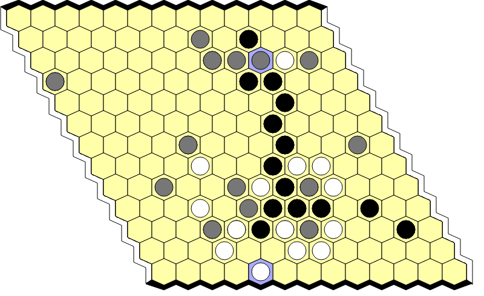

Hello.

Nex is a variant of [Hex](https://en.wikipedia.org/wiki/Hex_(board_game)), one
of the cleanest and simplest games in the world. You can read more about Hex at
the Wikipedia page.

Nex introduces the **neutral stone**, which belongs to neither player. It also
introduces a mechanism by which stones turn from neutral to your own color, and
vice versa. If you're usually playing Hex with black and white stones, it makes
sense to think of the neutral stones as gray.

In Nex there are two types of move:

1. **Placement**: Put one stone of your own color, and one neutral stone on the
board.

2. **Conversion**: Turn two neutral stones on the board into stones of your color,
and turn one stone of your color into a neutral stone.

(All positions involved have to be non-overlapping.)

These rules look a little bit arbitrary when you see them the first time, but they
have the pleasing property that (just like in Hex) no matter what move you make,
the number of your own stones increases by one. (Unless it's a swap, of course.)

Tactics and strategy feel quite different from Hex. There's a bigger sense of
risk and gambling, even though the game remains deterministic. Two-front attacks
seem quite efficient. Causing the opponent to want to do both a placement and a
conversion also seems like a common theme.

Have fun!
